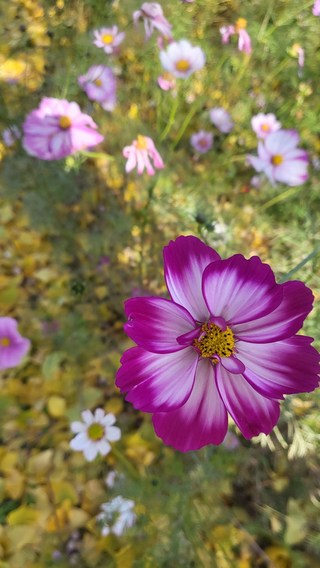
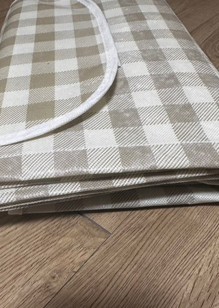
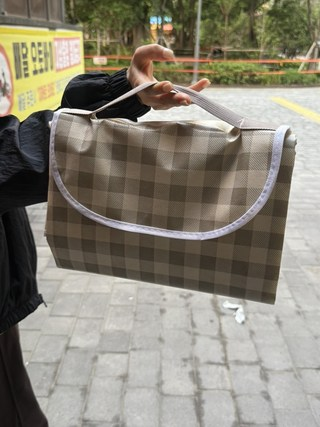

# 봄나들이 돗자리, 요즘 많이 찾는 방수 대형 매트 뭐가 괜찮을까?

날씨 풀리면 제일 먼저 생각나는 게 공원 나들이죠. 도시락 챙기고 커피 하나 들고 나가서 바람 쐬는 그 시간이 생각보다 큰 리프레시가 되잖아요. 그런데 막상 나가보면 바닥 상태가 늘 변수예요. 잔디가 살짝 젖어 있거나, 흙먼지가 올라오거나, 앉을 자리가 애매하면 금방 불편해집니다.

그래서 봄철에는 피크닉 매트를 고를 때 디자인보다 먼저 방수 여부와 크기를 보게 되더라고요. 사진 예쁘게 나오는 것도 좋지만, 실제로 오래 앉아 있어도 불편하지 않아야 결국 자주 쓰게 됩니다. 특히 가족이나 친구랑 같이 나가면 작은 사이즈는 금방 답답해져서 대형 매트가 체감상 훨씬 편합니다.

이번 글에서는 까사재클린 피크닉 대형 방수 체크 매트(195 x 200cm)를 기준으로, 어떤 상황에서 유용한지, 실제 사용 시 어떤 점을 체크하면 좋은지 정리해볼게요. 봄나들이 준비하면서 “가성비 괜찮은 매트 하나” 찾는 분들께 도움이 될 거예요.

리뷰 이미지를 보면 체크 패턴이 과하지 않아 사진 배경으로 쓰기 편한 스타일입니다. 깔아두기만 해도 전체 분위기를 정돈해주는 타입이라 소품 과하게 안 챙겨도 무난해요.

## 왜 요즘 방수 대형 매트를 많이 찾을까?

봄나들이는 생각보다 바닥 컨디션 영향을 많이 받습니다. 오전 이슬이 남아 있거나, 그늘 자리의 습기가 남아 있으면 일반 매트는 금방 축축해져요. 이때 하단 방수 코팅 여부가 체감 차이를 꽤 크게 만듭니다.

또 한 가지는 인원수예요. 2인 기준으로 샀다가 막상 간식, 가방, 외투까지 놓으면 공간이 부족해지는 경우가 많습니다. 195 x 200cm처럼 여유 있는 사이즈는 앉는 공간과 짐 공간을 분리하기 쉬워서 피크닉 동선이 편해집니다.

실제로 후기를 보면 “가족 단위 사용”, “공원에서 눕거나 쉬기 좋다”, “젖은 바닥 부담이 줄었다”는 포인트가 반복됩니다. 결국 봄철 나들이 매트는 예쁜 것만이 아니라 실사용 스트레스를 줄여주는지가 핵심입니다.

## 이 제품이 해결해주는 실제 불편 포인트

가장 큰 장점은 대형 사이즈에서 오는 여유입니다. 어른 여러 명이 함께 앉아도 동선이 덜 꼬이고, 음식과 개인 소지품을 나눠 놓기 쉬워요. 앉았다 일어날 때 서로 치이거나 물건 밟는 일이 줄어드는 것만으로도 만족도가 올라갑니다.

방수 코팅도 데일리 피크닉에는 확실히 실용적입니다. 음료를 조금 흘리거나 바닥이 살짝 젖은 상황에서도 정리가 편하고, 마른 티슈나 물티슈로 빠르게 닦아낼 수 있어요. 나들이 끝나고 정리 시간을 줄여주는 게 생각보다 큽니다.

그리고 접어서 들고 이동하는 과정도 중요하잖아요. 이 제품은 접었을 때 손잡이 형태로 들 수 있어 이동 부담이 덜한 편입니다. 차에서 공원까지 조금 걸어야 할 때 이런 디테일이 은근히 크게 느껴집니다.

## 제품 특징 한눈에 정리

구매 전에 핵심 스펙과 사용 포인트를 표로 보면 판단이 훨씬 빠릅니다.

| 항목 | 내용 |
|---|---|
| 제품명 | 까사재클린 피크닉 대형 방수 체크 매트 돗자리 |
| 사이즈 | 195 x 200 cm |
| 평점/리뷰 | 4.0 / 841 |
| 핵심 포인트 | 대형 사이즈, 하단 방수, 휴대 편의 |
| 추천 상황 | 공원 피크닉, 가족 나들이, 야외 휴식 |

현재 옵션/가격은 시기별로 바뀔 수 있으니, 구매 전 최신 정보를 확인하고 결정하는 걸 추천드립니다.  
[까사재클린 방수 체크 매트 최신 정보 확인](https://link.coupang.com/re/AFFSDP?lptag=AF2373838&pageKey=8880508259&itemId=25917179599&vendorItemId=85633964101&traceid=V0-153-aceautogen&subid=ace)

## 이런 분들에게 특히 추천합니다

첫째, 봄나들이를 자주 가는 분. 매번 다른 바닥 환경에서 사용해야 하니 방수와 정리 편의가 중요합니다. 이런 조건에서 대형 방수 매트는 실패 확률을 줄여줘요.

둘째, 2인 이상 함께 쓰는 분. 커플 피크닉도 짐이 생각보다 많아서 넉넉한 사이즈가 편하고, 가족 단위라면 대형 매트가 거의 필수에 가깝습니다.

셋째, 감성 사진도 챙기고 싶은 분. 체크 패턴이 과하지 않아서 음식/소품/의류와 무난하게 어울리고, 사진 배경으로도 정돈된 느낌을 줍니다.

마지막으로, 관리가 쉬운 제품을 찾는 분에게도 잘 맞습니다. 오염을 빠르게 닦고 접어서 이동할 수 있는지까지 보면 실제 만족도가 훨씬 좋아집니다.

## FAQ

### Q1. 방수 매트면 쿠션감도 좋은가요?
방수형 매트는 대체로 쿠션이 두툼한 타입보다는 관리 편의에 초점이 맞춰져 있습니다. 그래서 장시간 앉을 계획이라면 얇은 방석이나 추가 패드를 함께 쓰면 훨씬 편해요. 반대로 정리와 휴대는 간편해서 데일리 피크닉용으로는 장점이 큽니다. 사용 목적이 “폭신함”인지 “실용성”인지 먼저 정하면 선택이 쉬워집니다.

### Q2. 사이즈가 큰데 휴대하기 괜찮을까요?
대형 사이즈라도 접는 구조가 단순하면 이동은 생각보다 어렵지 않습니다. 손잡이 형태로 들 수 있으면 짧은 이동 동선에서 특히 편하고, 차량 이동 시에도 수납이 크게 어렵지 않은 편이에요. 다만 처음엔 접는 방향이 헷갈릴 수 있어 한두 번만 익혀두면 훨씬 빨라집니다. 피크닉 준비 시간을 줄이고 싶다면 이런 휴대성 요소를 꼭 보세요.

봄나들이용 매트로 크기·방수·가성비를 같이 보고 계셨다면, 아래에서 옵션을 한 번 비교해보세요.  
👉 [오늘 기준 옵션 자세히 보기](https://link.coupang.com/re/AFFSDP?lptag=AF2373838&pageKey=8880508259&itemId=25917179599&vendorItemId=85633964101&traceid=V0-153-aceautogen&subid=ace)

본 포스트는 쿠팡파트너스 활동의 일환으로, 이에 따른 일정 수수료를 제공받습니다.

