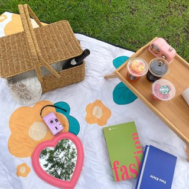
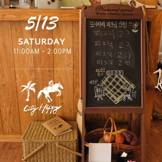
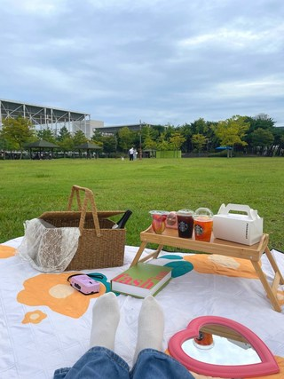

# 피크닉 바구니 세트 추천, 요즘 많이 찾는 라탄 보냉 바구니 실사용 후기 포인트

봄나들이 준비할 때 은근히 고민되는 게 짐 정리예요. 도시락, 과일, 물티슈, 컵, 작은 소품까지 챙기다 보면 가방이 여러 개로 늘어나고, 이동할 때 손이 너무 바빠지죠. 그래서 최근에는 “보기 좋은 감성템”보다 실제로 수납이 잘 되는 피크닉 바구니를 찾는 분들이 많아졌습니다.

특히 보냉 기능이 같이 들어간 바구니 세트는 준비 효율이 확실히 좋아요. 음료나 과일 온도를 짧은 외출 시간 동안 유지하기도 편하고, 피크닉 자리에서 꺼내는 동선도 깔끔해집니다. 예쁘기만 한 제품보다 실사용에서 덜 번거로운 제품이 결국 오래 살아남더라고요.

이번 글에서는 네이쳐리빙 데이지가든 보냉 라탄 피크닉 바구니+보냉백 세트를 기준으로, 어떤 상황에서 만족도가 높은지, 구매 전에 무엇을 확인하면 좋은지 정리해볼게요. 봄나들이 소품을 가볍게 업그레이드하고 싶은 분들에게 딱 맞는 내용입니다.

리뷰 이미지 기준으로 보면 라탄 느낌이 과하게 튀지 않아 피크닉 매트나 테이블웨어와 매치하기 쉬운 톤입니다. 그래서 소품을 많이 안 써도 전체 분위기를 정돈하기 좋아요.

## 왜 요즘 피크닉 바구니 세트를 찾게 될까?

피크닉이 유행처럼 보이지만, 실제로는 “짐 정리 스트레스”를 줄이려는 수요가 큽니다. 가방 여러 개를 들고 이동하면 출발 전부터 지치고, 현장에서도 물건 찾느라 시간이 계속 들어요. 한 바구니에 필수품을 모아두면 준비 시간이 눈에 띄게 줄어듭니다.

또 봄철은 낮 기온이 오르면서 음식/음료 관리가 미묘하게 어려워지는 시기입니다. 아이스박스까지는 부담스럽고, 그렇다고 보냉이 전혀 없으면 불안하죠. 이럴 때 보냉백 포함 바구니는 “무겁지 않게 챙기기”라는 현실적인 해법이 됩니다.

후기를 보면 디자인 만족도뿐 아니라 “생각보다 많이 들어간다”, “이동이 편하다”, “나들이 때 자주 꺼내게 된다”는 포인트가 반복됩니다. 결국 자주 쓰는 제품은 예쁨 + 편의가 같이 맞아야 합니다.

## 실제 사용에서 체감되는 장점과 한계

장점부터 보면 수납 구조가 단순해서 동선이 좋아요. 도시락 용기, 과일통, 컵류, 티슈류를 한 번에 담아도 정리가 되고, 현장에서 꺼내기 편합니다. 특히 여러 명이 함께 가는 피크닉에서 이 차이가 크게 느껴집니다.

보냉백이 세트로 포함된 점도 실사용성이 좋습니다. 아이스박스처럼 장시간 강한 보냉을 기대하기보다는, 나들이 시간 동안 간단한 식음료 상태를 안정적으로 유지하는 용도로 보면 충분히 만족스러워요.

다만 라탄 소재 특성상 사용 전 마감 상태를 한 번 확인하는 게 좋고, 보냉백은 처음에 냄새가 느껴질 수 있어 가볍게 환기 후 쓰는 편이 안전합니다. 이런 부분을 알고 시작하면 만족도가 더 높습니다.

## 제품 특징 한눈에 정리

구매 전에 핵심 스펙을 빠르게 보고 싶다면 아래 표를 참고해보세요.

| 항목 | 내용 |
|---|---|
| 제품명 | 네이쳐리빙 데이지가든 보냉 라탄 피크닉 바구니 + 보냉백 |
| 구성 | 바구니 + 보냉백 1세트 |
| 평점/리뷰 | 4.0 / 297 |
| 핵심 포인트 | 수납 편의, 감성 디자인, 가벼운 보냉 |
| 추천 상황 | 봄나들이, 소풍, 공원 피크닉 |

가격/옵션은 시점마다 달라질 수 있으니 구매 전 현재 구성은 한 번 확인해보는 걸 추천드립니다.  
[네이쳐리빙 라탄 피크닉 바구니 최신 정보 보기](https://link.coupang.com/re/AFFSDP?lptag=AF2373838&pageKey=6743583101&itemId=15750357746&vendorItemId=82964103549&traceid=V0-153-aceautogen&subid=ace)

## 이런 분들에게 특히 추천합니다

첫째, 피크닉 갈 때 짐이 늘 늘어나는 분. 바구니 하나로 동선을 정리하면 준비와 정리가 훨씬 편해집니다.

둘째, 사진 분위기도 챙기고 싶은 분. 라탄 바구니는 피크닉 매트/도시락 박스와 궁합이 좋아 소품 연출이 쉬운 편입니다.

셋째, 아이스박스는 부담스럽지만 최소한의 보냉은 필요한 분. 짧은 나들이 기준으로는 세트형 보냉백이 실속 있는 선택지예요.

그리고 “가성비 + 실사용” 기준으로 고르는 분에게도 추천할 만합니다. 너무 고가 소품보다 자주 쓰고 관리 쉬운 제품이 결국 만족도가 오래가니까요.

## FAQ

### Q1. 보냉 성능이 아이스박스 수준인가요?
아이스박스급 장시간 보냉을 기대하는 제품은 아닙니다. 대신 피크닉이나 소풍처럼 비교적 짧은 외출 시간에서 음료/간식 온도를 보조해주는 용도로는 충분히 실용적이에요. 무게와 휴대성을 함께 생각하면 균형이 좋은 편입니다. 사용 목적을 “강한 보냉”보다 “가벼운 보냉 + 수납 정리”로 잡으면 만족도가 높습니다.

### Q2. 실제로 수납이 넉넉한 편인가요?
후기 기준으로 도시락, 간식, 물티슈, 소품류를 함께 담기 괜찮다는 반응이 많았습니다. 다만 용기 크기나 구성에 따라 체감은 달라질 수 있으니, 평소 챙기는 물건 크기를 기준으로 보는 게 좋아요. 피크닉 인원이 2~4명 정도라면 활용도가 특히 높고, 자리에서 꺼내 쓰는 흐름도 편합니다. 처음엔 한 번 세팅해보면 자기 패턴이 금방 잡혀요.

봄나들이 짐 정리를 조금 더 편하게 하고 싶다면 아래 링크에서 구성과 가격을 확인해보세요.  
👉 [오늘 기준 옵션 자세히 보기](https://link.coupang.com/re/AFFSDP?lptag=AF2373838&pageKey=6743583101&itemId=15750357746&vendorItemId=82964103549&traceid=V0-153-aceautogen&subid=ace)

본 포스트는 쿠팡파트너스 활동의 일환으로, 이에 따른 일정 수수료를 제공받습니다.

